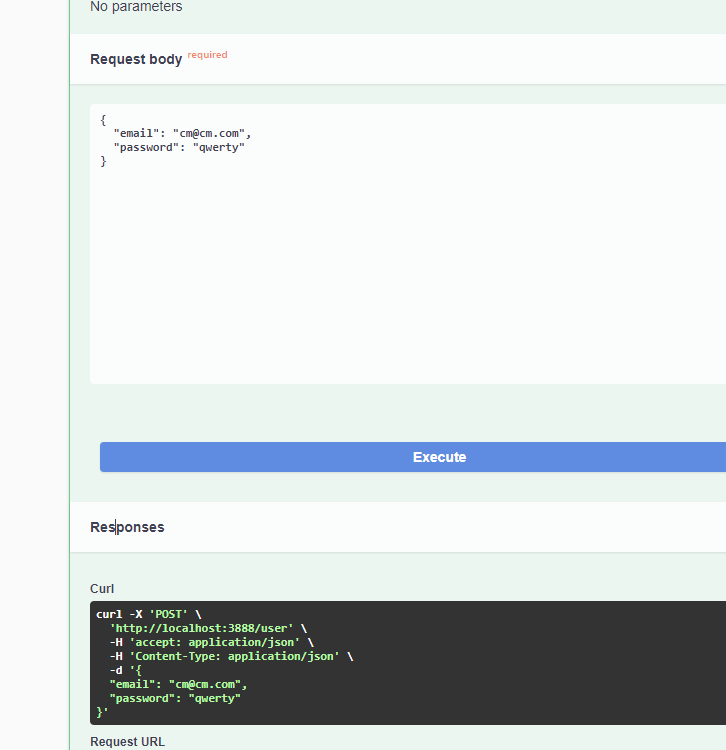
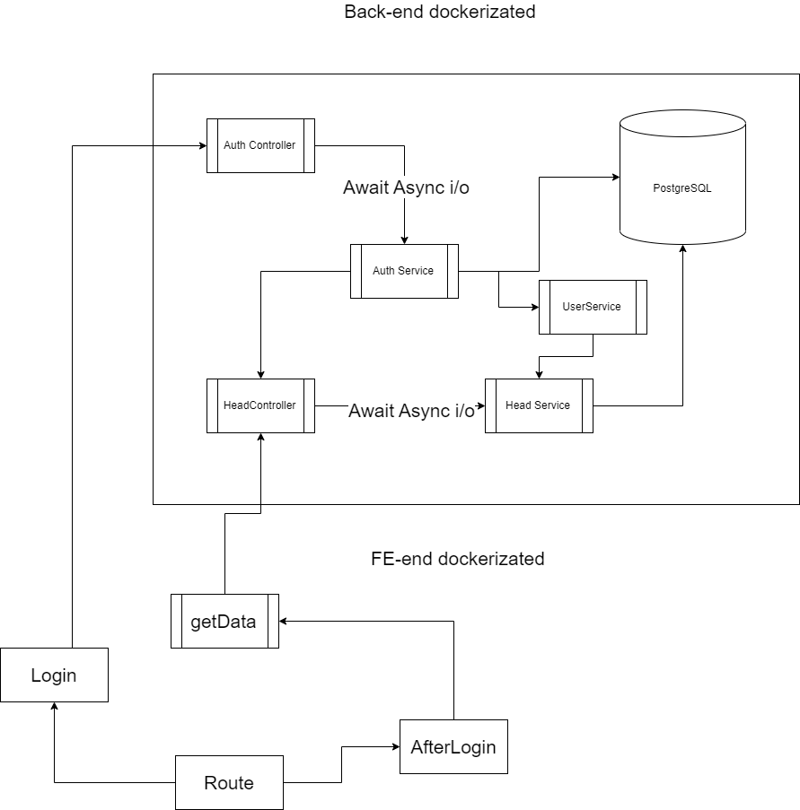
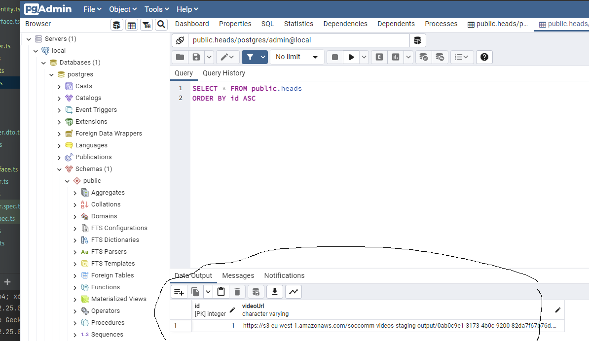
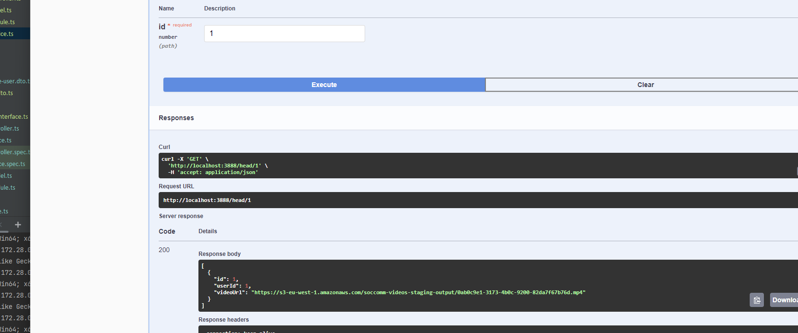

## Installation

### Running the app

```bash
$ docker-compose up
```

## API Swagger Url
```bash
$ http://localhost:3888/api/docs/
```

## Access to PG_ADMIN

```bash
# username
$ pgadmin4@pgadmin.org

# password
$ admin

# url
$ http://localhost:5050/
```

## Access to container
```bash
# docker exec -it <container_name> sh
```
## Access to POSTGRE_SQL

```bash
# user
$ admin

# password
$ secret

# DB
$ postgres

# port
$ 5432

# url
$ postgres
```

## Goal
### Demonstrate below skills:

* dockerization with nginx for proxy
* backend part implemented with typescript 
* use concurrency, race condition
* use postgreSQL and i/o data with DTOs
* use typeOrm and configs
* implement third-party service talking heads in separate module
* how implement tests - added for User Service, you can see in (user-controller.spec.ts)
* frontend part implemented with svelte and js
* for frontend part for login used store
* for getting data from third-party service for specific user using promise async await on FE
```bash
# access to urls

# api backend
$ http://localhost:3888/

# api backend swagger
$ http://localhost:3888/api/docs

# pg-admin
$ http://localhost:5050/

# svelte front-end part
$ http://localhost:3001/
```
### How check flow

Didn't implement for FE part sign-up, just login. To create user just open swagger doc and create user or use curl
```bash
# curl
curl -X 'POST' \
  'http://localhost:3888/user' \
  -H 'accept: application/json' \
  -H 'Content-Type: application/json' \
  -d '{
  "email": "cm@cm.com",
  "password": "qwerty"
}'
```


First run 
```bash
docker-compose up
```
1. Login
2. After the logging store saved and redirect to after login section (didn't implement localStorage or sessionStorage - to keep auth data), just for SPA.
3. click introduce
4. see video with auth id user, firstName added like argument to backend
5. additionally added endpoint for history (see swagger head endpoint), where can fetch all videos which has been played for specific user

### Logical Flow Diagram




### Get url from third-party-service
